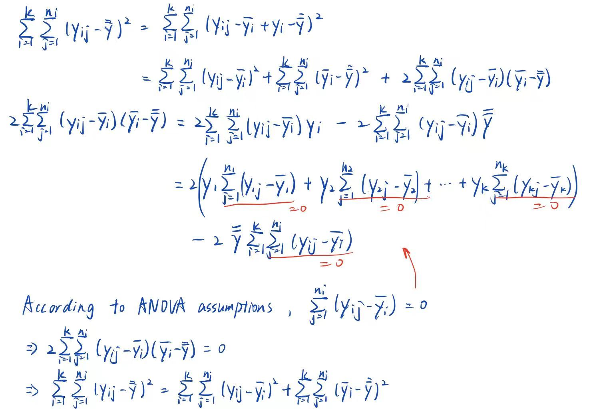
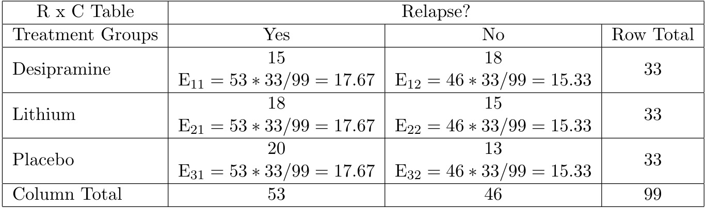

```{r message=FALSE}
library(tidyverse)
library(ggplot2)
```


## Problem 1
**In the context of ANOVA model, prove the partitioning of the total variability (sum of squares).**

```{r echo=FALSE}

```


## Problem 2
**An emergency department physician is interested in examining the relationship between type of crash ('car', 'bicycle' and 'pedestrian incidents') and PTSD score. Records from patients 18-30 years old were collected and provided to you for statistical analysis (dataset “Crash.csv”).**
```{r message=FALSE}
crash <- read_csv("./Crash.csv")
```

**Assuming that data are normally distributed, answer the questions below: **

**a) Generate descriptive statistics for each group and comment on the differences observed.**
```{r message=FALSE, warning=FALSE}
summary(crash$pedestrian)
ggplot(crash, aes(x = pedestrian)) + 
  geom_histogram() + 
  labs(title = "Distribution of PTSD Scores for Pedestrian Crash")
```

```{r message=FALSE, warning=FALSE}
summary(crash$bicycle)
ggplot(crash, aes(x = bicycle)) + 
  geom_histogram() + 
  labs(title = "Distribution of PTSD Scores for Bicycle Crash")
```

```{r message=FALSE, warning=FALSE}
summary(crash$car)
ggplot(crash, aes(x = car)) + 
  geom_histogram() + 
  labs(title = "Distribution of PTSD Scores for Car Crash")
```

By looking at the summary table, we shall notice that the average PTSD score for pedestrian crash > average PTSD score for bicycle crash > average PTSD score for car crash, and maximum and minimum PTSD scores have the same trends. The histograms show that three groups are not normally distributed. Distribution of PTSD scores is approximately symmetric for bicycles, right-skewed for car, and left skewed for pedestrian.

**b) Using a type I error of 0.01, obtain the ANOVA table. State the hypotheses, test statistic, critical value, and decision interpreted in the context of the problem.**

```{r}
new_crash <- 
  pivot_longer(crash, pedestrian:car, names_to = "types", values_to = "levels")%>%
  mutate(types = factor(types))

res = aov(levels ~ types, data = new_crash)
summary(res)
```

Null hypothesis: mean PTSD scores for all three types of crash are equal.  
Alternative hypothesis: at least two of the mean PTSD scores are different.

Test statistics: $F=\frac{Between\ SS/2}{Within\ SS/22}=19.35$

Critical value: $F_{2,22,0.99}=5.72$
```{r}
qf(0.99,2,22)
```

Decision: At $\alpha=0.01$ significance level, $F_{test}>F_{crit}$, so we can reject the null hypothesis and conclude that at least two of mean PTSD scores from the three groups are different.

**c) Based on your response in part b), perform pairwise comparisons with an appropriate adjustment (e.g., Bonferroni, Tukey, and Dunnett – 'below average' as reference). Report your findings.** 

The overall error rate at significance level 0.01 is $FWER \leq 1-(1-0.01)^3=0.0297$.
Bonferroni adjustment is performed.
```{r}
pairwise.t.test(new_crash$levels, new_crash$types, p.adj = 'bonferroni')
```
At $\alpha=0.01$ significance level, the mean PTSD scores of car crash and bicycle crash are significantly different, and the mean PTSD scores of car crash and pedestrian crash are significantly different.

**d) Write a short paragraph summarizing your overall results as if you were presenting to the emergency department physician.**

According to the PTSD scores data collected from patients 18-30 years old and the result of ANOVA, we can conclude that at least two of the mean PTSD scores among three types of crashes are different at a significance level 0.01. Specifically, there is a statistically significant difference between mean PTSD scores of car crash and bicycle crash, and there is a statistically significant difference between mean PTSD scores of car crash and pedestrian crash. By looking at mean PTSD scores of these three types of crashes, we can furthermore conclude that mean PTSD scores of car crash is significantly smaller than bicycle crash and pedestrian crash.

## Problem 3

**A three-year study compared an antidepressant called desipramine with lithium and a placebo. The subjects were 99 chronic users of cocaine who wanted to break their drug habit. Subjects were evenly and randomly assigned to groups in order to show that the probability of a subject’s relapse is associated with the drug the subject was assigned to. The researchers observed that 15 subjects relapsed on desipramine, 18 subjects relapsed on lithium and 20 subjects relapsed on placebo. Use a 5% level of significance to test the researchers’ claim by answering the questions below.**

**a) Justify the appropriate test to be used for addressing the question of interest.**

Chi-squared test, because subjects were evenly and randomly assigned to groups, and we want to compare three independent proportions in this case. 

**b) Provide the table with all values necessary for calculating the test statistic.**

```{r echo=FALSE}

```

**c) State the hypotheses, test statistic, critical value, p value and decision rule interpreted in the context of the problem.** 
Null hypothesis: the proportions of subjects relapsed on all three types of treatments are equal.  
Alternative hypothesis: not all proportions are equal.

Calculate the test statistic:
\begin{align*}
    \chi ^2=\sum_{i=1}^3\sum_{j=1}^2\frac{(O_{ij}-E_{ij})^2}{E_{ij}}=&\frac{(15-17.67)^2}{117.67}+\frac{(18-17.67)^2}{17.67}+\\
    &\frac{(20-17.67)^2}{17.67}+\frac{(18-15.33)^2}{15.33}+\\
    &\frac{(15-15.33)^2}{15.33}+\frac{(13-15.33)^2}{15.33}\\
    &=1.54
\end{align*}

Calculate critical value: $\chi ^2_{df=2, 0.95}=5.99$
```{r}
qchisq(p=0.95, df=2)
```


p-value: 0.46
```{r}
pchisq(q=1.54, df=2, lower.tail = FALSE)
```

Decision: because $\chi ^2 < \chi ^2_{2, 0.95}$, we failed to reject the null hypothesis, and conclude that there is no evidence showing significant difference in the proportions of subjects relapsed on three types of treatments. So there is no difference in the efficacy of desipramine, lithium, and placebo on preventing chronic users of cocaine from relapsing.
